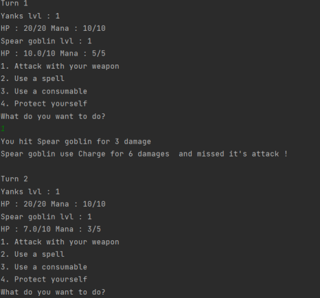
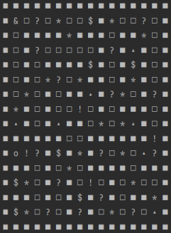

## Introduction
Dans le but de mettre en pratique les connaissances acquises durant le cours de JAVA, on 
nous a demandé faire un projet reprenant toutes les notions vues durant ce dit cours. Ainsi 
Mr BOUKEBIR et Mr ADELER ont choisi de faire un jeu vidéo de type RPG dans le style des 
vieux jeux RPG textuelles.

## Origine du projet
Etant tout deux fan de jeu-vidéo, l’idée d’en faire un est parvenue assez rapidement. Le style 
du jeu est celui qui représente le mieux toutes les notions vues et est assez commun. Le jeu 
s’est alors assez naturellement dénommé RPGISEN pour des raisons évidentes. 

## Fonctionnement du jeu - Gameplay
RPGISEN est un jeu basé seulement sur des lignes de commandes. Le joueur est invité par 
le jeu à entrer l’action qu’il souhaite effectuer. Cette dernière est imposée en amont par du 
texte inscrit sur son écran.
À l’instar de tout RPG le joueur se déplace sur une carte qui est affichée. On peut y voir 
différentes cases. Le joueur représenté par un « & » peut donc se déplacer et rencontrer 
différents éléments tels que des marchands des ennemies ou des coffres. 
Le joueur ne peut interagir qu’une seule fois avec chaque élément. Et l’interaction ne se fait 
que si le joueur se trouve sur la case de l’élément.
Le joueur possède plusieurs statistiques : Les HP représentant les points de vies du 
personnage, une fois à 0, la partie prend fin. Le mana, correspondant à la capacité à utiliser 
des sorts. La force et la dextérité, permettant d’infliger plus de dégâts avec les armes 
(Gourdin : 2*force, arc : 2*dextérité, épée :1*force + 1*dextérité). Le joueur possède 
également un équipement, une arme et armure, qui augmentent respectivement les dégâts 
et l’armure. En plus de cela, un inventaire permet d’équiper d’autres armes et armures. Le 
joueur peut également utiliser des potions qui soignent les HP ou le mana.
Durant un combat, le joueur à 4 choix possibles, attaquer, utiliser un sort, utiliser un objet 
consommable, ou se défendre, doublant sa défense. Après cela, l’ennemi attaque à son tour 
jusqu’à la mort d’un des deux acteurs du combat.
La victoire du joueur entraine un gain d’expérience (permettant d’augmenter 2 statistiques 
par niveau) et d’argent (permettant l’achat d’équipements).
La map est divisée en 4 zones chacune délimitées par un boss, que le joueur doit affronter 
pour accéder à la zone suivante, jusqu’à arriver à la fin, représenter par un ‘o’.

## Exemple de gameplay
Comme expliquer plus tôt le joueur se déplace sur une carte. L’image à gauche
montre la carte. On peut voir que le joueur est tout en haut à gauche. La fin du jeu 
se situe à la case « 0 ».
Sur l’image de droite, on peut voir l’image. Le 
début d’un combat. Il est lancé via la case « * ». Le 
joueur doit choisir son action l’ennemie jouera son 
tour. 
On peut également voir diverses cases 
correspondantes chacune à divers évènements. 

## Fonctionnement du jeu -Organisation
Le diagramme de classe est disponible en annexe mais nous allons malgré tout discuter de 
l’organisation du jeu. Le jeu possède d’abord une map, se trouvant dans un fichier JSON. 
Elle est décryptée est composée de tuiles correspondantes chacune à un élément du jeu.
Les tuiles déclenchent aléatoirement les évènements stockés dans GameObjects. 
GameObjects contient d’ailleurs toutes les variables de jeu, évènements, équipements, 
ennemis, sorts etc… (nous aurions aimé avec plus de temps implémenté les variables de jeu 
dans un fichier JSON). 
Les évènements sont répartis comme étant des enfants de TypeEvents et correspondent aux 
marchands, coffres, inconnus… 
Le héros et les ennemis sont des enfants d’entité et possèdent chacun des stats et des sorts.
Le combat se déroule dans une classe à part de la fonction main.
Les objets sont tous des équipements ayant chacun leurs classes filles, armes, armures et 
consommables.

## Difficultés rencontrées
Lors de la création de ce projet, nous n’avions aucune expérience en JAVA, donc l’aspect de 
travailler sur un nouveau langage représente une difficulté, cependant, cette dernière est 
normale lors de toute phase d’apprentissage et l’habitude de changer souvent de langage 
permet d’appréhender plus facilement les nouveaux langages. 
Néanmoins la notion propre à ce langage qui est l’interface a été assez complexe à 
comprendre son utilité en elle-même et son implémentation a été souvent questionnés. En 
effet, réfléchir un jeu en « objet orienté » a été un défi et imaginer un jeu en raisonnant ainsi 
s’est révélé plus dur que prévu.
Une autre difficulté était de s’organiser entre nous pour faire correspondre le jeu comme on 
l’imaginait. Beaucoup de concessions ont été faites afin de permettre au jeu d’être mené à 
termes, notamment en termes de gameplay, qui se retrouve réduit par rapport à ce que l’on 
imaginait au départ, même si nous en sommes tout de même fier.

## Succès de l’équipe
Le fait d’avoir pu coder dans un nouveau langage et réussir à finir un projet est déjà une 
grande source de satisfaction. 
De plus, la modularité du code ainsi que le fait qu’il soit relativement simplement d’ajouter
des variantes au code afin d’offrir une expérience plus riche pour le joueur est aussi une 
source importante de satisfaction. Le code étant fait à partir d’objet, l’implémentation de 
nouveau évènements, ennemis, sorts, armes, statistiques est de ce fait facile et ne requiert 
que très peu de modifications.

## Pistes d’améliorations
Avec plus de temps, nous aurions aimé améliorer le gameplay, laisser au joueur plus de 
possibilités, rendre les statistiques plus pertinents, les combats plus techniques. Ajouter des 
évènements serait également pertinents, tout comme plus d’ennemis, de boss etc…

## Conclusion
Ce projet nous a permis de créer un code fonctionnel, nous permettant ainsi de comprendre 
l’usage et l’intérêt d’un langage orienté objet. Il a été un défi intéressant à accomplir, et 
l’avoir mené à termes nous rends très fiers, malgré la limite de temps et de moyen. Ce projet 
nous à donné envie d’essayer de travailler sur un projet ambitieux et à plus grandes échelles.
